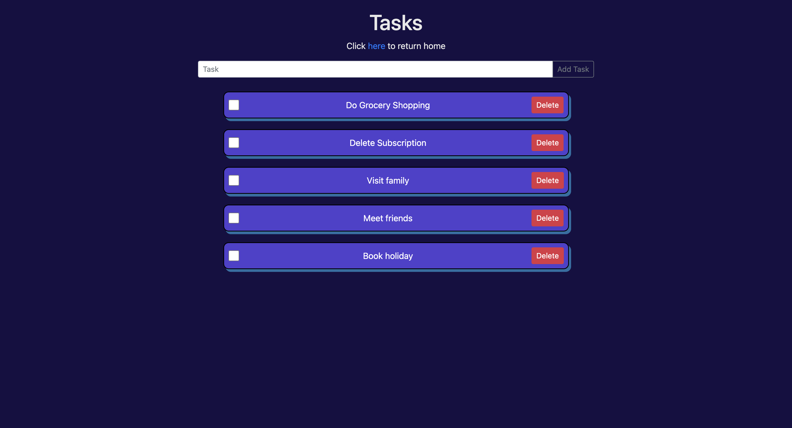

# to-do-web-app
This is a to do list web app with a basic frontend created with bootstrap to practice backend development using a node.js runtime, the express framework for routing and Mongodb as the database. 

